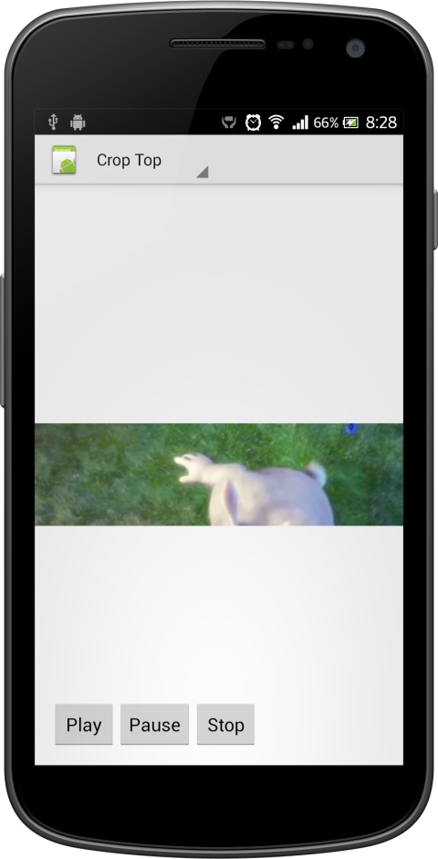

:small_red_triangle: **Before using this library, read information below** :small_red_triangle:
```
This library is not more supported. 
If you want to add new feature or fix a bug, grab source code and do it. If you think your
fix or feature would be useful to other developers, I can add link of your repository to
this README file. Use following e-mail to contact me: dmytrodanylyk@gmail.com
Thank you for using my libraries.

```

## Preview





## Description

[`TextureVideoView`](/library/src/com/dd/crop/TextureVideoView.java) is custom view based on android [`TextureView`](http://developer.android.com/reference/android/view/TextureView.html) which gives you ability easily  play and crop video. It's very similar to [`ImageView#setScaleType`](http://developer.android.com/reference/android/widget/ImageView.html#setScaleType(android.widget.ImageView.ScaleType))

Crop modes:

 - TOP
 - CENTER_CROP
 - BOTTOM

## Usage

Include library module to your project or copy [`TextureVideoView`](/library/src/com/dd/crop/TextureVideoView.java) class to your package.


```xml
<com.dd.crop.TextureVideoView
        android:id="@+id/cropTextureView"
        android:layout_width="fill_parent"
        android:layout_height="100dp"/>
```

```java
TextureVideoView cropTextureView = (TextureVideoView) findViewById(R.id.cropTextureView);
// Use `setScaleType` method to crop video
cropTextureView.setScaleType(TextureVideoView.ScaleType.TOP);
// Use `setDataSource` method to set data source, this could be url, assets folder or path
cropTextureView.setDataSource("http://www.w3schools.com/html/mov_bbb.mp4");
cropTextureView.play();
```

## How it works?

Read [Texture View - Video Cropping](http://goo.gl/WAikcl) Article

## API

ver 1.0

```java

/**
 * Play or resume video. Video will be played as soon as view is available and media player is
 * prepared.
 *
 * If video is stopped or ended and play() method was called, video will start over.
 */
TextureVideoView.play()

/**
 * Pause video. If video is already paused, stopped or ended nothing will happen.
 */
TextureVideoView.pause()

/**
 * Stop video (pause and seek to beginning). If video is already stopped or ended nothing will
 * happen.
 */
TextureVideoView.stop()

/**
 * Sets the data source (file-path or http/rtsp URL) to use.
 */
TextureVideoView.setDataSource(String)

/**
 * Sets the data source as a content Uri.
 */
TextureVideoView.setDataSource(Context, Uri)

/**
 * Sets the data source (FileDescriptor) to use.
 */
TextureVideoView.setDataSource(AssetFileDescriptor)

/**
 * Sets the player to be looping or non-looping.
 */
TextureVideoView.setLooping(boolean)

/**
 * Seeks to specified time position. (milliseconds)
 */
TextureVideoView.seekTo(int)

/**
 * Gets the duration of the file.
 */
TextureVideoView.getDuration()

/**
 * Listener trigger `onVideoPrepared` and `onVideoEnd` events
 */
TextureVideoView.setListener(MediaPlayerListener)
```

## License

```
The MIT License (MIT)

Copyright (c) 2014 Danylyk Dmytro

Permission is hereby granted, free of charge, to any person obtaining a copy
of this software and associated documentation files (the "Software"), to deal
in the Software without restriction, including without limitation the rights
to use, copy, modify, merge, publish, distribute, sublicense, and/or sell
copies of the Software, and to permit persons to whom the Software is
furnished to do so, subject to the following conditions:

The above copyright notice and this permission notice shall be included in all
copies or substantial portions of the Software.

THE SOFTWARE IS PROVIDED "AS IS", WITHOUT WARRANTY OF ANY KIND, EXPRESS OR
IMPLIED, INCLUDING BUT NOT LIMITED TO THE WARRANTIES OF MERCHANTABILITY,
FITNESS FOR A PARTICULAR PURPOSE AND NONINFRINGEMENT. IN NO EVENT SHALL THE
AUTHORS OR COPYRIGHT HOLDERS BE LIABLE FOR ANY CLAIM, DAMAGES OR OTHER
LIABILITY, WHETHER IN AN ACTION OF CONTRACT, TORT OR OTHERWISE, ARISING FROM,
OUT OF OR IN CONNECTION WITH THE SOFTWARE OR THE USE OR OTHER DEALINGS IN THE
SOFTWARE.
```
